<div align="center">

# 🏥 Healthcare Appointment Booking System
### A ZenThink Technologies Internship Task


<p align="center">
  <a href="#-features">Features</a> •
  <a href="#-tech-stack">Tech Stack</a> •
  <a href="#-getting-started">Getting Started</a> •
  <a href="#-project-structure">Structure</a> •
  <a href="#-troubleshooting">Troubleshooting</a>
</p>

</div>

---

## 📖 Overview

A comprehensive, cross-platform mobile application designed to bridge the gap between patients, doctors, and administrators. The app facilitates seamless appointment booking, secure medical record storage (using Cloudinary & Firestore), and robust doctor verification workflows.

This project adheres to the **MVVM (Model-View-ViewModel)** architecture to ensure separation of concerns and code scalability.

---

## 📱 Screenshots
### User Flow

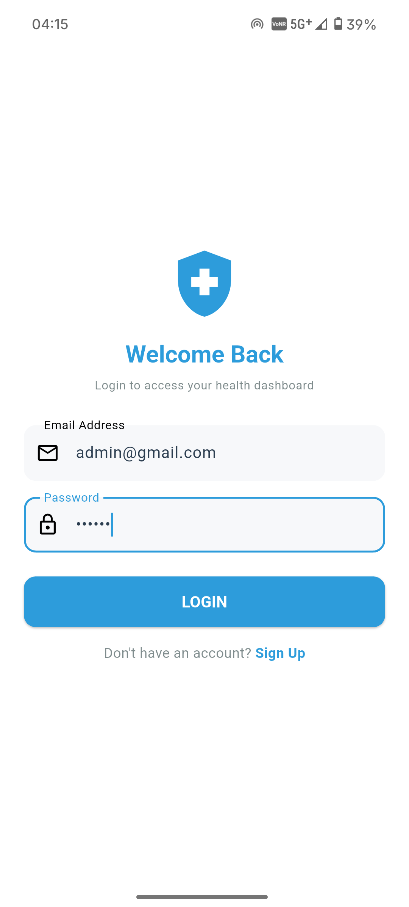
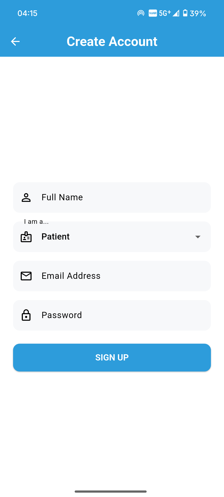
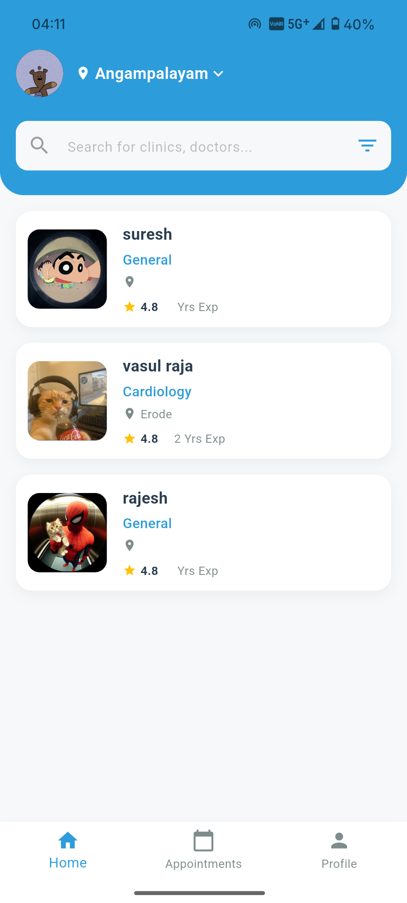
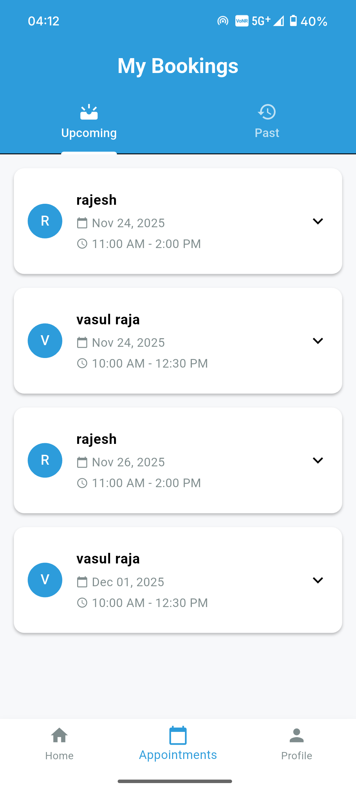
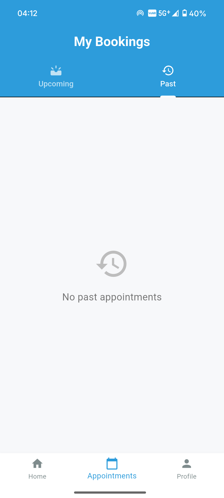
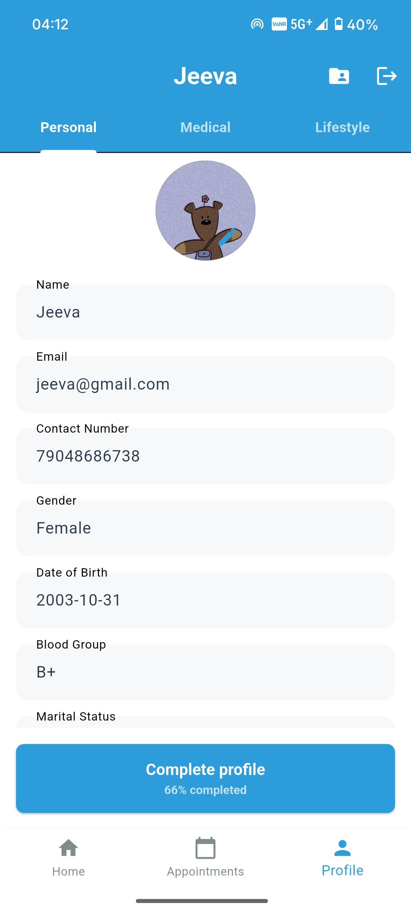
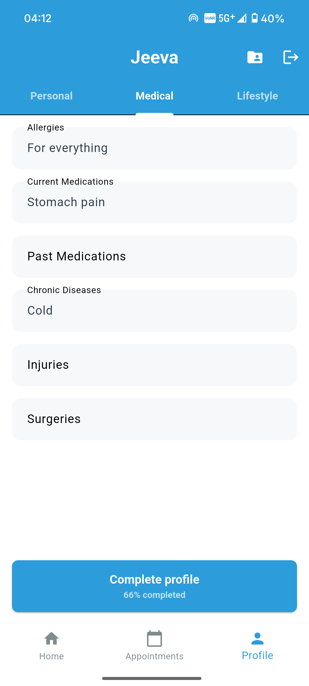
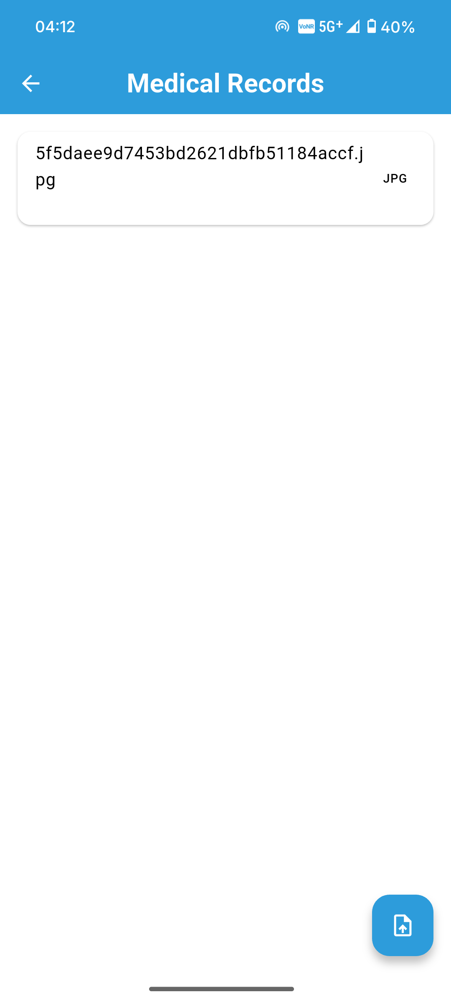
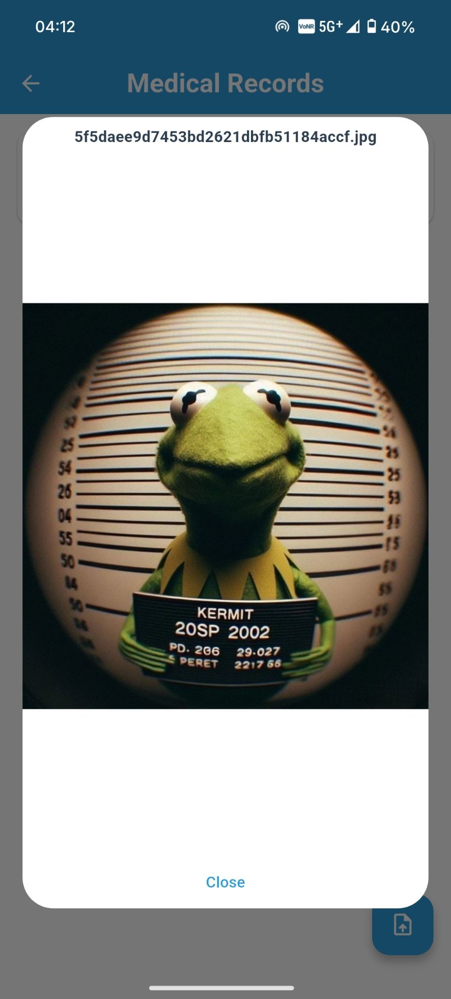

### Doctor Flow
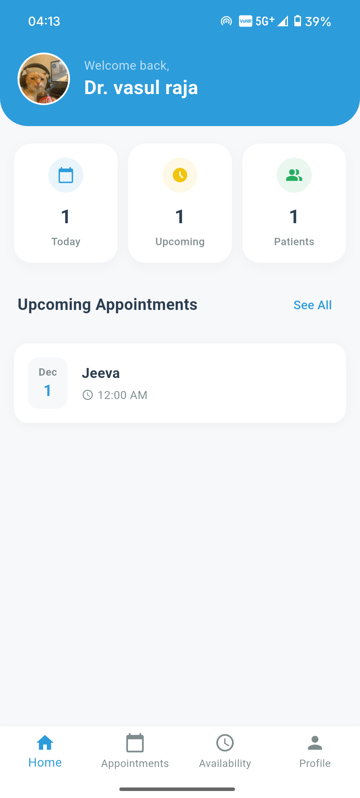
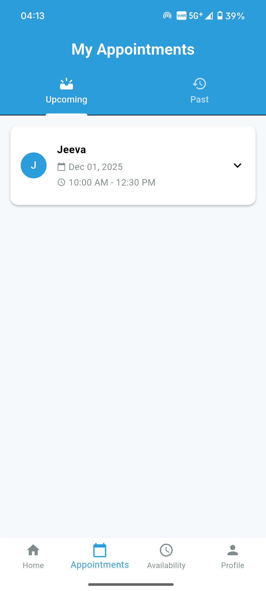
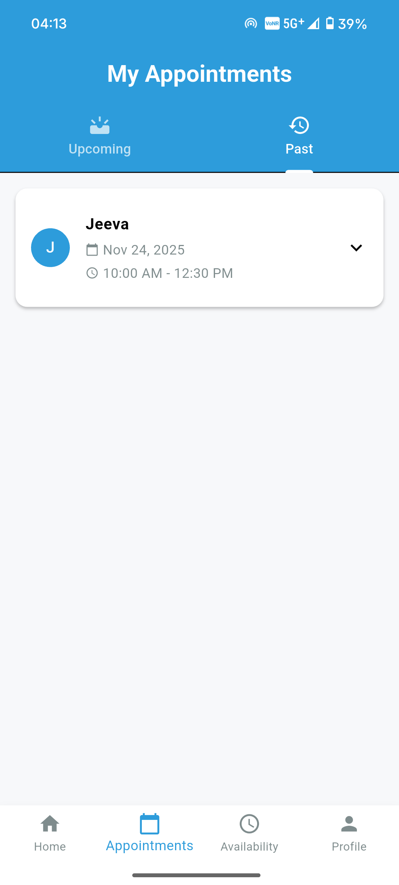
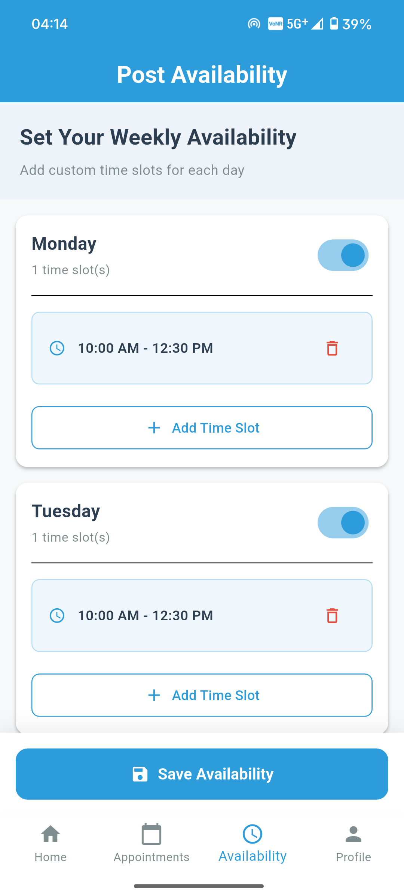
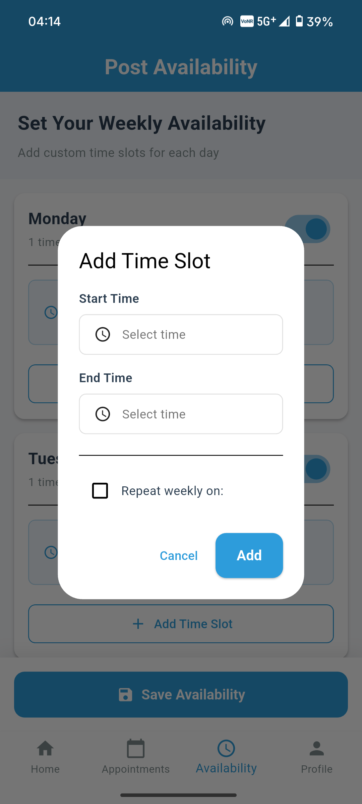
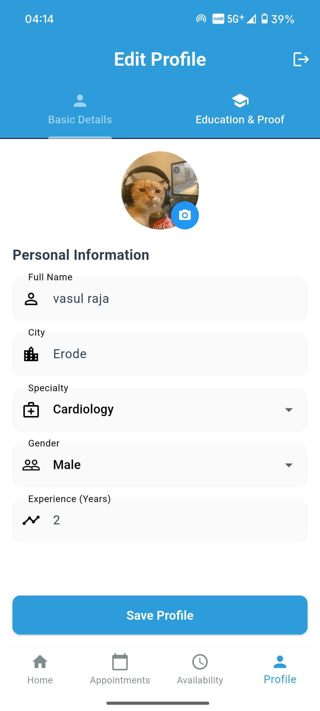
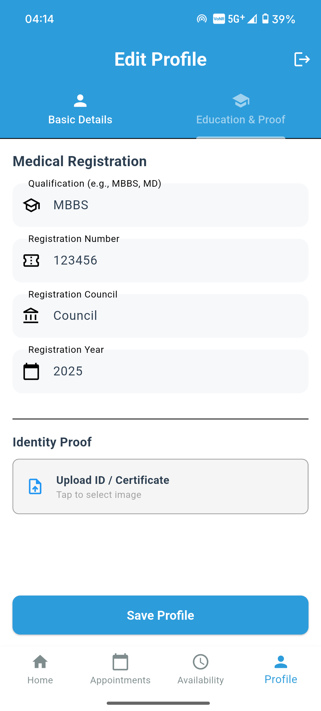

### Admin Flow
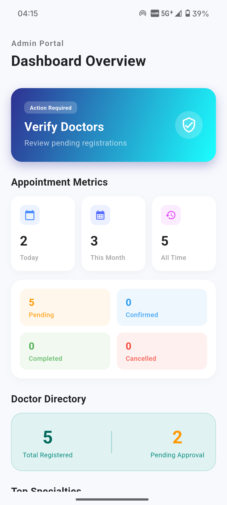


## ✨ Features

### 🩺 Patient
- [x] **Authentication:** Secure login/signup via Firebase.
- [x] **Doctor Discovery:** Browse verified doctors by specialty.
- [x] **Smart Booking:** Slot reservation system.
- [x] **Records:** Upload medical files (Cloudinary) with metadata storage.
- [x] **Status Tracking:** "Upcoming" vs "Past" appointments (Auto-classified with 10min buffer).

### 👨‍⚕️ Doctor
- [x] **Profile Management:** Set professional details.
- [x] **Dashboard:** Quick view of Today's, Upcoming, and Total Patient stats.
- [x] **Schedule Management:** View appointments sorted by time.

### 🛡️ Admin
- [x] **Analytics:** Visual metrics for Total Appointments and Specialties.
- [x] **Verification:** Approve or Reject doctor registrations.
- [x] **System Oversight:** Monitor registration rates.

---

## 🛠 Tech Stack

- **Frontend:** Flutter (Material 3 Design)
- **Backend:** Firebase (Authentication, Firestore Database)
- **Storage:** Cloudinary (Image/File hosting)
- **State Management:** Provider / ChangeNotifier
- **Architecture:** MVVM

---

## 🚀 Getting Started

Follow these steps to get a local copy up and running.

### Prerequisites
* Flutter SDK (Stable Channel)
* Android Studio / VS Code
* A Firebase Project

### Installation

1.  **Clone the repository**
    ```bash
    git clone <your-repo-url>
    cd healthcare_app
    ```

2.  **Install Dependencies**
    ```bash
    flutter pub get
    ```

3.  **Environment Configuration (Crucial)**
    > ⚠️ **Note:** You must provide your own API keys.

    * **Firebase:** Place `google-services.json` in `android/app/` and `GoogleService-Info.plist` in `ios/Runner/`.
    * **Cloudinary:** Update credentials in `lib/core/services/cloudinary_service.dart`:
        ```dart
        const String cloudName = "YOUR_CLOUD_NAME";
        const String uploadPreset = "YOUR_PRESET";
        ```

4.  **Run the App**
    ```bash
    flutter run
    ```

---

## 📂 Project Structure

A high-level overview of the MVVM implementation:

```text
lib/
├── main.dart                  # Entry point, Providers setup
├── core/                      # Constants, Utils, Services (Cloudinary/Firebase)
├── data/                      # Data Layer
│   └── models/                # AppointmentModel, UserModel, MedicalRecordModel
├── view_models/               # Business Logic (ChangeNotifiers)
│   ├── auth_view_model.dart
│   ├── doctor_home_view_model.dart
│   └── ...
└── views/                     # UI Layer
    ├── widgets/               # Reusable components
    └── screens/
        ├── auth/              # Login/Register
        ├── patient/           # Patient workflows
        ├── doctor/            # Doctor workflows
        └── admin/             # Admin Dashboard